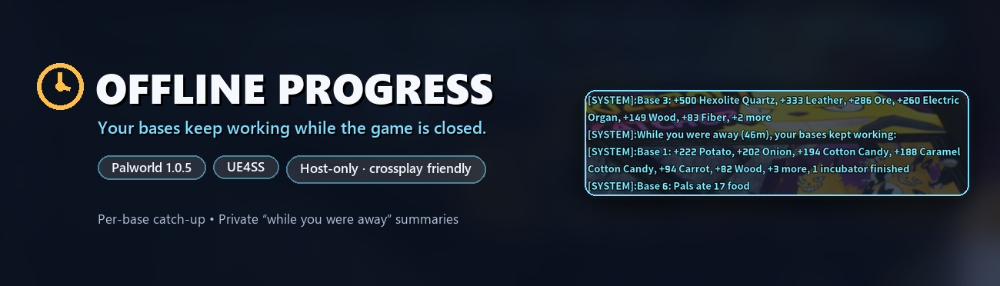

# Offline Progress for Palworld

Your bases keep working while the game is closed.

When you load a world, Offline Progress works out what each of your bases would have produced
while the world was offline and puts it in storage. It does this in about a second during
loading, the way mobile idle games handle time away. Every player then gets a private "while you
were away" summary of their own bases.

> Built for **Palworld 1.0.5** with **UE4SS** (Okaetsu's experimental Palworld build).
> Tested working in single-player, and with a Steam host and a PS5 player joining through
> crossplay.

```
While you were away (2h 15m), your bases kept working:
• Base 2
    +74 Red Berries · +23 Baked Berries · +17 Honey
    +17 Milk · +14 Wood · +10 Wheat · +1 more item
    2 eggs laid
• Base 5
    +2,403 Stone · +1,750 Wood · +1,640 Ore · +126 Fiber
    +51 Tomato · +42 Lettuce · +3 more items
    1 egg hatched · 1 expedition moved ahead
• Base 7
    +224 Pure Quartz · +50 Stone · +32 Ore
    Pals ate 20 food
```

## Features

- **Learns from your own bases.** Nothing is hard-coded. While you play, the mod measures what
  each base actually produces and eats, with separate rates for day and night. Balance patches,
  new Pals and rebuilt production lines are picked up automatically.
- **Realistic catch-up.** Storage fills up, feed boxes run dry, and Pals stop working when there's
  no food. Offline work runs at 75% by default and is capped at 24 hours.
- **More than items.** Incubators keep hatching and breeding farms keep laying eggs (with cake).
  Expeditions and medical-bed revivals finish on time; the game stops their clock while the world
  is closed.
- **Per-player summaries.** After each catch-up, every player gets a private chat summary and
  pickup popups for the bases they placed. Players who are offline get theirs when they next join.
- **Only the host needs it.** Other players need nothing installed, on any platform.
- **Safe by design.** Every write to storage is read back. If anything doesn't match, or a
  catch-up didn't make it into the save, the mod switches to safe mode and only logs. Eggs,
  weapons and armour are never touched.

## Requirements

- Palworld **1.0.5**
- **UE4SS for Palworld** by Okaetsu (experimental-palworld build):
  [Nexus Mods](https://www.nexusmods.com/palworld/mods/2237) ·
  [GitHub](https://github.com/Okaetsu/RE-UE4SS/releases)

**Single-player and multiplayer both work.** Both have been tested, so the world's Multiplayer
setting can be on or off. No in-game settings are needed.

## Installation

### Single-player and co-op host

1. Install UE4SS for Palworld, if it isn't installed already.
2. Extract the release zip into your Palworld folder, usually
   `C:\Program Files (x86)\Steam\steamapps\common\Palworld`.
   The mod ends up in `Palworld\Pal\Binaries\Win64\ue4ss\Mods\OfflineProgress`.
3. Start the game and load your world.

Older UE4SS layouts keep mods in `Pal\Binaries\Win64\Mods` instead. If that's yours, move the
`OfflineProgress` folder there.

### Dedicated server

Install UE4SS on the server, then extract the zip into the `PalServer` folder.
`extras/start-server.ps1` in this repository backs up the world save before each start.

> Dedicated servers use the same code path as a co-op host, but haven't been tested yet.
> Please report how it goes.

### Your first session

There's no setup step, but an hour of normal play is recommended before relying on it. The mod
learns from your bases as you play, measuring each one every 10 minutes while nobody is inside
it, and catches an item up once it has 6 measurements. In normal play that's about an hour, often
less for bases you're away from. Items without enough measurements yet simply aren't added.

To start sooner, lower `minSamples` in the config. Fewer measurements means less accurate rates.
Learned rates are kept in `OfflineProgress/state.lua` and carry over between sessions.

## Configuration

Settings are in `OfflineProgress/Scripts/config.lua`. The most useful ones:

| Setting | Default | What it does |
|---|---|---|
| `dryRun` | `false` | `true` only logs what the catch-up would do and changes nothing |
| `maxCatchupHours` | `24` | Longer downtime is capped here |
| `workEfficiency` | `0.75` | Offline production as a fraction of the measured rate |
| `summary.enabled` | `true` | Per-player "while you were away" summary |
| `summary.popups` | `5` | Pickup popups for the biggest gains (`0` for chat only) |
| `summary.maxLinesPerMessage` | `16` | Lines per chat message; the summary normally fits in one. `1` sends each line separately |
| `itemWriteMode` | `"topUpOnly"` | Only grows existing stacks. `"full"` also fills empty slots |

### Optional features

Each kind of change can be switched on or off under `live`. Anything switched off is only logged,
so you can check what it would do first.

| Feature | Default | What it does |
|---|---|---|
| `items` | on | Production added to storage, food eaten from feed boxes |
| `timers` | on | Incubators (with an egg) and other self-running work |
| `expeditions` | on | Expeditions and medical-bed revivals |
| `breeding` | on | Breeding farms lay the eggs they would have (needs Pals and cake in the farm) |
| `crafting` | off | Crafting queues advance and their products are added |
| `spoilage` | off | Food in storage ages by the downtime |
| `palNeeds` | off | Base Pals get hungry once food runs out; sanity drifts |
| `worldTime` | off | The in-game clock and day counter move forward (needs CheatManagerEnablerMod) |
| `crops` | off | Crop plots keep growing (visual only) |

## How it works

1. **Downtime** is measured per world, from the time of the loaded save or the last save the mod
   saw finish, to the moment the world loads.
2. **Rates.** Every 10 minutes the mod compares each base's storage. A rise becomes production, a
   fall becomes use, and feed boxes count as food. Windows with a player inside the base are
   skipped, and zero output only counts if nothing was blocking production.
3. **Catch-up.** The downtime is split into day and night stretches using the game's measured clock
   speed, then into segments wherever something changes (an input runs out, storage fills, Pals run
   out of food). Each segment is solved directly.
4. **Ownership.** A base belongs to whoever placed its Palbox. Storage shared by several bases goes
   to the owners of all of them.

## Logs and troubleshooting

Everything the mod does is logged to `Pal\Binaries\Win64\ue4ss\UE4SS.log`, in lines starting with
`[OfflineProgress]`. Each load shows what it found, how long the world was offline, and every
change it made, read back from storage:

```
[OfflineProgress] Catching up 2.25 hours.
[OfflineProgress]   D6662A2A: CopperOre 33116 -> 33543 (wanted +427)
```

- **Nothing was added.** Each item needs 6 measurements first, about an hour of normal play
  (see [Your first session](#your-first-session)). Look for `N rate(s)` in the log.
- **"SAFE MODE".** A write didn't read back as expected, or the last catch-up wasn't in the save.
  Check the line before it, then set `clearSafeMode = true` once you're happy.
- **A breeding farm laid no eggs.** It needs its Pals, cake and room for eggs. After loading, the
  mod waits up to a minute for the Pals to walk back to it. The `breeding farm at ...` line shows
  its progress, eggs and cake, and the line after it says why it was skipped.
- **Version mismatch.** After a Palworld update the mod only logs until it's updated.
- **Start over.** Delete `OfflineProgress/state.lua` to forget all learned rates.

## Performance

The mod does no per-frame work. It runs on timers, on the host only:

- **At load:** about 1–1.5 seconds for the catch-up, while you're loading in.
- **Every 10 minutes:** one storage measurement, about 0.2 seconds.
- **Every minute / every 5 seconds:** a few milliseconds.

Set `debugTiming.enabled = true` to log any step that takes longer than 5 ms.

## Known limitations

- Rates are measured per item, so production that never reaches storage isn't seen. Linked
  crafting chains are handled when `crafting` is on.
- The in-game clock can only be moved forward to the next morning and to whole hours.
- Raids, visitors, merchants and wild respawns don't happen offline.
- Tested in single-player, and with a Steam host and a PS5 player joining through crossplay.
  Game Pass hosts and dedicated servers haven't been tested yet.

## Uninstalling

Delete the `OfflineProgress` folder. Items the mod already added stay in your world.

## Development

```bash
pip install lupa
python tests/run_tests.py
python tools/build_release.py
```

The tests run the mod against fake game objects shaped like Palworld 1.0.5. The build script
runs the tests, checks the release settings, and writes `dist/OfflineProgress-v<version>.zip`.

Only `OfflineProgress/Scripts/adapter.lua` touches Palworld's objects. After a game update,
that's the file to check against a fresh UE4SS header dump.

## Credits

- Mod by **yog1**
- [UE4SS](https://github.com/UE4SS-RE/RE-UE4SS) and the Palworld build by
  [Okaetsu](https://github.com/Okaetsu/RE-UE4SS)
- Palworld by Pocketpair. This is an unofficial fan mod, not affiliated with Pocketpair.

## License

[MIT](LICENSE)
